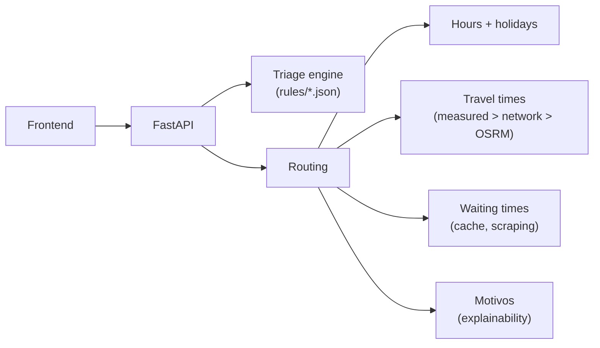

# Onde ir? Patient guidance for Madeira (RAM) — prototype (SESARAM)

This repository is a working prototype for a hospital-side application that guides patients to the right point of care in the Autonomous Region of Madeira: it triages symptoms through simple yes/no questions, estimates a Manchester-style priority colour, and recommends where to go — directly to the reference hospital for the most urgent colours (red, orange and yellow, per SESARAM guidance), or the nearest suitable open unit given the current time and opening hours. Since v0.13.1, every recommendation also explains itself: the response carries the ordered list of factors that produced it. The user-facing text and the code comments are written in Portuguese, because the target users and the health service are Portuguese; even so, the architecture, the data-driven clinical rules and the routing logic make it a solid, reusable base — an excellent prototype to build a real service on.

*("Onde ir?" means "Where to go?". A Portuguese version of this document is available in `README.pt.md`.)*


## The project in numbers

| | |
| --- | --- |
| Automated tests | **408**, all passing — **92% coverage** of `app/` |
| Clinical triage flows | **56** Manchester flowcharts + emergency red-flags screen · **1187 discriminators** (PT, with EN discriminator names) |
| Health units covered | **46** (2 hospitals + 44 health centres), with opening hours, holidays and live waiting times |
| Territory modelled | **11 municipalities · 54 parishes · 143 localities**, for manual location without GPS |
| Road times | **598 measured origin→destination pairs** on top of a calibrated road network |
| REST API | **17 endpoints**, interactive docs at `/docs` |
| Server-side storage of patient data | **None** — stateless by design (GDPR) |
| Works offline | Yes — local vendor libraries; only map tiles and live waits degrade |

*(Numbers as of v0.16.2. Tests and coverage are re-measured with
`python scripts/cobertura_testes.py --atualizar-readme`, which also
refreshes the badges above; the remaining figures come from the data
files in `app/data/`, checked by `scripts/validar_dados.py`.)*

## Important notices (read first)

1. **Clinical validation is mandatory.** Since v0.14.0 the flows in
   `app/data/rules/` are the **Manchester Triage discriminators**,
   imported verbatim from the reference table (flowchart, priority,
   discriminator and clinical description) — see
   `scripts/importar_manchester.py`. They, and the colour → service-type
   mapping in `app/core/routing.py`, still require review and approval by
   the SESARAM clinical team before any use with real patients. Note: the
   official Manchester Triage flowcharts are licensed (Grupo Português de
   Triagem). The current status of what is and is not validated is tracked
   in [`docs/VALIDATION.md`](docs/VALIDATION.md).
2. **Unit data to be confirmed.** In `app/data/unidades.json`, coordinates
   are approximate and addresses, phone numbers, services and opening hours
   are marked with `(CONFIRMAR)` and `"dados_confirmados": false`.
   Everything must be confirmed with SESARAM before any real use.
3. **Privacy (GDPR).** The application does not store any patient data:
   there is no database, no sessions and no logging of answers. Location is
   used only at the moment of calculation and never stored. Keep it this way.
4. The tool **does not replace** clinical assessment or the official triage
   performed at emergency departments; the disclaimer shown in the interface
   is mandatory.

## How to run

Requirements: Python 3.11 or newer.

```bash
python -m pip install -r requirements.txt      # first time only
python -m uvicorn app.main:app --reload        # start the server
```

Then open http://127.0.0.1:8000 (application), http://127.0.0.1:8000/docs
(interactive API), http://127.0.0.1:8000/fluxogramas (live flowchart
preview, an internal tool for whoever edits the rules) or
http://127.0.0.1:8000/revisao (patient-content review, in two sections:
the advice and the questions, each clinical text side by side with the
lay PT/EN sentence, each item's validation state and what the safety
filter hides — an internal tool for the clinical team,
v0.15.2/v0.15.3). Stop with Ctrl+C;
after code changes, hard-refresh the browser with Ctrl+F5. The running
version can be checked at `/api/saude`.

With Docker, none of the above is needed:

```bash
docker compose up --build
```

Run the tests and the data checks:

```bash
python -m pytest                            # 408 tests
python scripts/cobertura_testes.py          # coverage (optionally --html)
python scripts/validar_dados.py             # validate every JSON data file
python scripts/auditar_traducoes.py         # report untranslated strings
python scripts/benchmark_desempenho.py      # latency of the main endpoints
```

Optional: isolate the dependencies with `python -m venv .venv` and activate
it before installing (Windows: `.venv\Scripts\activate`; macOS/Linux:
`source .venv/bin/activate`).

## How it works (3 blocks)

1. **Triage** — the frontend first asks about emergency signs
   (`red_flags.json`): if any is selected → red and 112. Otherwise, the
   patient picks a complaint and answers yes/no questions. Each complaint
   is a sequence of **Manchester discriminators** ordered by priority (P1
   to P5): the engine checks them from the highest priority down and the
   first "yes" decides the colour; if all are "no", the outcome is blue.
   The engine is *stateless*: the frontend resends all answers with each
   request and gets
   back the next question or the result.
2. **Colour** — the result has a colour (red, orange, yellow, green, blue)
   with a target observation time, shown as a wristband.
3. **Routing** — given the colour, the location and the time in Madeira,
   `routing.py` decides where to send the patient: red, orange and yellow
   go **directly to the reference hospital** (editable policy in
   `app/data/encaminhamento.json`); green and blue get the nearest open
   unit with the right service, never a closed health centre at 3 a.m.
   Every response includes `motivos` — the ordered list of factors behind
   the decision, shown in the interface as "Why this recommendation?".



The *why* behind the design — rules as data, no database, the layered
travel model, how the system degrades — lives in
[`docs/ARCHITECTURE.md`](docs/ARCHITECTURE.md), with each decision also
summarised as a one-page ADR in [`docs/adr/`](docs/adr/README.md).

## Main features

- **Editable clinical rules**: one JSON file per complaint, validated at
  startup (unique ids, complete branches, valid colours, no cycles); the
  server refuses to start with malformed rules. Editing guide:
  [`docs/DATA_GUIDE.md`](docs/DATA_GUIDE.md).
- **Time-aware routing**: opening hours per service, national + RAM
  regional holidays (computed, no internet) plus per-municipality
  holidays, and the island rule —
  recommendations never cross the sea.
- **Travel times by road**, not straight lines: a local table of 598
  measured pairs, a calibrated road network as fallback, and optional
  OSRM support for the institution.
- **Live waiting times** scraped from the public SESARAM pages, with a
  short-TTL cache, negative caching and honest degradation ("unavailable",
  never invented numbers); an experimental, clearly-flagged rule can
  prefer a slightly farther unit when it saves a lot of total time.
- **Explainability (v0.13.1)**: every recommendation carries its ordered
  list of reasons, bilingual, shown as "Why this recommendation?".
- **Bilingual interface (PT/EN)** end to end — including the clinical
  flows — with an auditor script that reports anything untranslated.
- **One-page PDF** of the referral, local on-device history, manual
  location down to the locality, offline-friendly frontend (local vendor
  libraries), and a live Mermaid preview of the flowcharts for editors.
- **Application logging** (v0.13.1): startup summary, scraping and OSRM
  warnings, safe-fallback warnings — never any user data.

## API (summary)

- `GET /api/saude` — health check (version)
- `GET /api/queixas` · `GET /api/red-flags` — complaints and emergency signs
- `POST /api/triagem` — `{queixa, respostas}` or `{red_flags}` → next question or result
- `POST /api/encaminhamento` — `{cor, lat, lng[, quando, destino]}` → full
  recommendation, with the applied `politica` block and the `motivos` list
- `GET /api/unidades` · `GET /api/unidades/proxima` — units and nearest units
- `GET /api/espera` — real-time waiting times (cache) · `GET /api/viagem` — travel estimate
- `GET /api/localidades` · `GET /api/feriados` · `GET /api/contactos` ·
  `GET /api/fluxogramas` — supporting data
- `POST /api/exportar_pdf` · `POST /api/integracao/triagem` — PDF export and
  the integration-oriented endpoint (see [`docs/INTEGRACAO.md`](docs/INTEGRACAO.md))

Full request/response shapes: http://127.0.0.1:8000/docs.

## Project structure

```
onde-ir-sesaram/
├── app/
│   ├── main.py               # FastAPI application (API + static frontend + logging)
│   ├── api/routes.py         # REST endpoints
│   ├── models/schemas.py     # request validation (Pydantic)
│   ├── core/
│   │   ├── triage_engine.py  # triage engine (reads the JSON rule files)
│   │   ├── routing.py        # colour + location + time → destination (decides)
│   │   ├── routing_textos.py # the user-facing phrases of routing (words it; v0.13.1)
│   │   ├── motivos.py        # "why this recommendation?" list (explains it; v0.13.1)
│   │   ├── horarios.py / feriados.py   # open/closed now; holidays (computed)
│   │   ├── viagem.py / tempos_medidos.py # travel times (network + table + optional OSRM)
│   │   ├── espera.py         # live waiting times (scraping + cache + fallbacks)
│   │   ├── localidades.py / geo.py / unidades.py / cores.py / fluxogramas.py
│   │   └── pdf_clinico.py    # the one-page PDF
│   └── data/                 # everything editable without code (see docs/DATA_GUIDE.md)
├── static/                   # frontend (HTML + CSS + plain JS, vendor local)
├── docs/                     # architecture, ADRs, validation, performance, guides
├── scripts/                  # tools for data editors and maintenance
├── tests/                    # pytest
├── .github/workflows/ci.yml  # CI: data validation + translation audit + tests
├── CHANGELOG.md              # full version history (PT: CHANGELOG.pt.md)
└── Dockerfile / docker-compose.yml
```

## Documentation

| Document | What it answers |
| --- | --- |
| [`docs/ARCHITECTURE.md`](docs/ARCHITECTURE.md) | How to think about the system: the decisions and the why. (PT: [`ARQUITETURA.md`](docs/ARQUITETURA.md)) |
| [`docs/adr/`](docs/adr/README.md) | The same decisions as one-page ADRs, one file each. |
| [`docs/DATA_GUIDE.md`](docs/DATA_GUIDE.md) | Editing rules, units, hours; demo mode. (PT: [`GUIA_DOS_DADOS.md`](docs/GUIA_DOS_DADOS.md)) |
| [`docs/VALIDATION.md`](docs/VALIDATION.md) | What is validated and what is pending. (PT: [`VALIDACAO.md`](docs/VALIDACAO.md)) |
| [`docs/PERFORMANCE.md`](docs/PERFORMANCE.md) | Measured latency of the main endpoints. |
| [`docs/INTEGRACAO.md`](docs/INTEGRACAO.md) | Integration with SESARAM systems: status and open questions. |
| [`CHANGELOG.md`](CHANGELOG.md) | Everything that changed, version by version. |

**Latest version: v0.16.2** — readable data errors end to end, sanity
limits on requests (anti-abuse), Public Sans self-hosted (offline +
GDPR), response formats documented in `/docs`, 3.11+3.12 CI matrix and
a license
(see [`CHANGELOG.md`](CHANGELOG.md) for this and every previous version).

## Known limitations

- Outside the areas covered by the local table, driving times come from a
  **simplified, hand-calibrated network** with typical values: no live
  traffic, no rush hour, and short local hops are approximated. They are
  estimates for ranking and expectation-setting, not navigation.
- The unit data still includes entries to be confirmed (see the notice at
  the top and the `"dados_confirmados"` field).
- The triage rules and advice texts are examples, not yet clinically
  validated — [`docs/VALIDATION.md`](docs/VALIDATION.md) tracks exactly what
  is pending.
- Automatic location, on a computer, is estimated from the internet
  connection and may be imprecise; the user can always correct it by
  choosing the municipality and, if known, the parish and locality.

## License

The **code** of this prototype is under the MIT license — see
[`LICENSE`](LICENSE); the rights holder is pending confirmation between
the internship author and SESARAM (hence the bracketed field). The code
license does **not** cover:

- the **clinical content** derived from the Manchester Triage table
  (`app/data/rules/`, advice): the official flowcharts are licensed by
  the Grupo Português de Triagem and real use requires their
  authorisation (see the notice at the top);
- the **vendored libraries** in `static/vendor/`, each with its licence
  alongside (Leaflet and qrcode-generator: BSD/MIT; Mermaid: MIT; the
  Public Sans typeface: SIL Open Font License 1.1).
