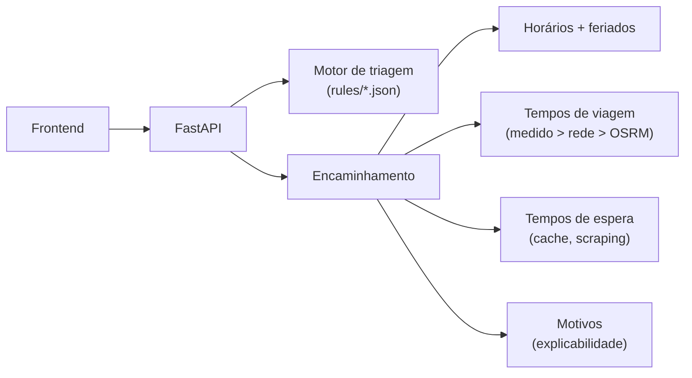

# Onde ir? Orientação de utentes na Madeira (RAM) — protótipo (SESARAM)

Este repositório contém um protótipo funcional de uma aplicação, do lado do hospital, que orienta os utentes para o ponto de atendimento certo na Região Autónoma da Madeira: faz uma triagem dos sintomas através de perguntas simples de sim/não, estima uma cor de prioridade ao estilo de Manchester, e recomenda para onde ir — diretamente para a urgência do hospital de referência nas cores mais graves (vermelho, laranja e amarelo, conforme indicação do SESARAM), ou para a unidade adequada aberta mais próxima, tendo em conta a hora atual e os horários. Desde a v0.13.1, cada recomendação também se explica: a resposta traz a lista ordenada dos fatores que a produziram. Os textos para o utente e os comentários no código estão em português, porque os utentes-alvo e o serviço de saúde são portugueses; ainda assim, a arquitetura, as regras clínicas orientadas a dados e a lógica de encaminhamento fazem dele uma base sólida e reutilizável — um excelente protótipo para construir um serviço real.

*(English version: `README.md`.)*


## O projeto em números

| | |
| --- | --- |
| Testes automáticos | **408**, todos a passar — **92% de cobertura** de `app/` |
| Fluxos de triagem clínica | **56** fluxogramas de Manchester + ecrã de sinais de emergência · **1187 discriminadores** (PT, com nomes dos discriminadores em EN) |
| Unidades de saúde cobertas | **46** (2 hospitais + 44 centros de saúde), com horários, feriados e tempos de espera reais |
| Território modelado | **11 concelhos · 54 freguesias · 143 sítios**, para localização manual sem GPS |
| Tempos por estrada | **598 pares origem→destino medidos** sobre uma rede de estradas calibrada |
| API REST | **17 endpoints**, documentação interativa em `/docs` |
| Dados de utentes guardados no servidor | **Nenhuns** — sem estado, por desenho (RGPD) |
| Funciona offline | Sim — bibliotecas locais; só os tiles do mapa e os tempos ao vivo degradam |

*(Números à data da v0.16.2. Os testes e a cobertura são remedidos com
`python scripts/cobertura_testes.py --atualizar-readme`, que também
atualiza os badges acima; os restantes números vêm dos ficheiros de
dados em `app/data/`, verificados por `scripts/validar_dados.py`.)*

## Avisos importantes (ler primeiro)

1. **A validação clínica é obrigatória.** Desde a v0.14.0 os fluxos em
   `app/data/rules/` são os **discriminadores da Triagem de Manchester**,
   importados tal e qual da tabela de referência (fluxograma, prioridade,
   discriminador e descrição clínica) — ver `scripts/importar_manchester.py`.
   Estes, e o mapeamento cor → tipo-de-serviço em `app/core/routing.py`,
   ainda têm de ser revistos e aprovados pela equipa clínica do SESARAM
   antes de qualquer uso com utentes reais. Nota: os fluxogramas oficiais
   da Triagem de Manchester são licenciados (Grupo Português de Triagem).
   O estado do que está e não está validado é acompanhado em
   [`docs/VALIDACAO.md`](docs/VALIDACAO.md).
2. **Dados das unidades por confirmar.** Em `app/data/unidades.json`, as
   coordenadas são aproximadas e as moradas, telefones, serviços e
   horários estão marcados com `(CONFIRMAR)` e `"dados_confirmados": false`.
   Tudo tem de ser confirmado com o SESARAM antes de qualquer uso real.
3. **Privacidade (RGPD).** A aplicação não guarda nenhum dado do utente:
   não há base de dados, sessões nem registo das respostas. A localização
   é usada apenas no momento do cálculo e nunca guardada. Manter assim.
4. A ferramenta **não substitui** a avaliação clínica nem a triagem
   oficial feita nas urgências; o aviso mostrado na interface é obrigatório.

## Como correr

Requisitos: Python 3.11 ou superior.

```bash
python -m pip install -r requirements.txt      # só na primeira vez
python -m uvicorn app.main:app --reload        # arrancar o servidor
```

Depois abrir http://127.0.0.1:8000 (aplicação), http://127.0.0.1:8000/docs
(API interativa), http://127.0.0.1:8000/fluxogramas (pré-visualização
viva dos fluxogramas, uma ferramenta interna para quem edita as regras) ou
http://127.0.0.1:8000/revisao (revisão do conteúdo ao utente, em duas
secções: o aconselhamento e as perguntas, cada texto clínico lado a lado
com a frase leiga PT/EN, o estado de validação por item e o que o filtro
de segurança esconde — ferramenta interna para a equipa clínica,
v0.15.2/v0.15.3).
Parar com Ctrl+C; após mudar código, recarregar o browser com Ctrl+F5. A
versão em execução pode ser confirmada em `/api/saude`.

Com Docker, não é preciso nada do acima:

```bash
docker compose up --build
```

Correr os testes e as verificações de dados:

```bash
python -m pytest                            # 408 testes
python scripts/cobertura_testes.py          # cobertura (opcional --html)
python scripts/validar_dados.py             # validar todos os ficheiros de dados
python scripts/auditar_traducoes.py         # apontar strings por traduzir
python scripts/benchmark_desempenho.py      # latência dos endpoints principais
```

Opcional: isolar as dependências com `python -m venv .venv` e ativar antes
de instalar (Windows: `.venv\Scripts\activate`; macOS/Linux:
`source .venv/bin/activate`).

## Como funciona (3 blocos)

1. **Triagem** — o frontend pergunta primeiro pelos sinais de emergência
   (`red_flags.json`): se algum for selecionado → vermelho e 112. Caso
   contrário, o utente escolhe uma queixa e responde a perguntas de
   sim/não. Cada queixa é uma sequência de **discriminadores de
   Manchester** ordenados por prioridade (P1 a P5): o motor verifica-os
   da prioridade mais alta para a mais baixa e o primeiro «sim» decide a
   cor; se todos forem «não», o desfecho é azul. O motor é *sem estado*:
   o frontend reenvia todas as respostas a cada pedido e recebe a próxima
   pergunta ou o resultado.
2. **Cor** — o resultado tem uma cor (vermelho, laranja, amarelo, verde,
   azul) com um tempo-alvo de observação, mostrada como uma pulseira.
3. **Encaminhamento** — dada a cor, a localização e a hora na Madeira, o
   `routing.py` decide para onde enviar o utente: vermelho, laranja e
   amarelo vão **diretamente para a urgência do hospital de referência**
   (política editável em `app/data/encaminhamento.json`); verde e azul
   recebem a unidade aberta mais próxima com o serviço certo, nunca um
   centro de saúde fechado às 3 da manhã. Todas as respostas incluem
   `motivos` — a lista ordenada dos fatores por trás da decisão, mostrada
   na interface como "Porquê esta recomendação?".



O *porquê* por trás do desenho — regras como dados, sem base de dados, o
modelo de viagem em camadas, como o sistema degrada — vive em
[`docs/ARQUITETURA.md`](docs/ARQUITETURA.md), com cada decisão também
resumida como um ADR de uma página em [`docs/adr/`](docs/adr/README.md).

## Funcionalidades principais

- **Regras clínicas editáveis**: um ficheiro JSON por queixa, validado no
  arranque (ids únicos, ramos completos, cores válidas, sem ciclos); o
  servidor recusa arrancar com regras malformadas. Guia de edição:
  [`docs/GUIA_DOS_DADOS.md`](docs/GUIA_DOS_DADOS.md).
- **Encaminhamento consciente da hora**: horários por serviço, feriados
  nacionais + regionais da RAM (calculados, sem internet) e feriados
  municipais aplicados a cada concelho, e a regra da
  ilha — as recomendações nunca atravessam o mar.
- **Tempos por estrada**, não em linha reta: uma tabela local de 598 pares
  medidos, uma rede de estradas calibrada como recuo, e suporte opcional
  de OSRM para a instituição.
- **Tempos de espera reais** obtidos das páginas públicas do SESARAM, com
  cache de TTL curto, cache negativa e degradação honesta ("indisponível",
  nunca números inventados); uma regra experimental, claramente assinalada,
  pode preferir uma unidade um pouco mais longe quando poupa muito tempo
  total.
- **Explicabilidade (v0.13.1)**: cada recomendação traz a sua lista
  ordenada de motivos, bilingue, mostrada como "Porquê esta recomendação?".
- **Interface bilingue (PT/EN)** de uma ponta à outra — incluindo os fluxos
  clínicos — com um script auditor que aponta o que estiver por traduzir.
- **PDF de uma página** do encaminhamento, histórico local no dispositivo,
  localização manual até ao sítio, frontend amigo do offline (bibliotecas
  locais), e uma pré-visualização viva em Mermaid dos fluxogramas.
- **Logging na aplicação** (v0.13.1): resumo no arranque, avisos de
  scraping e OSRM, avisos de recuo seguro — nunca dados do utente.

## API (resumo)

- `GET /api/saude` — health check (versão)
- `GET /api/queixas` · `GET /api/red-flags` — queixas e sinais de emergência
- `POST /api/triagem` — `{queixa, respostas}` ou `{red_flags}` → próxima pergunta ou resultado
- `POST /api/encaminhamento` — `{cor, lat, lng[, quando, destino]}` →
  recomendação completa, com o bloco `politica` aplicado e a lista `motivos`
- `GET /api/unidades` · `GET /api/unidades/proxima` — unidades e mais próximas
- `GET /api/espera` — tempos de espera em tempo real (cache) · `GET /api/viagem` — estimativa de viagem
- `GET /api/localidades` · `GET /api/feriados` · `GET /api/contactos` ·
  `GET /api/fluxogramas` — dados de apoio
- `POST /api/exportar_pdf` · `POST /api/integracao/triagem` — exportação em
  PDF e o endpoint orientado a integração (ver [`docs/INTEGRACAO.md`](docs/INTEGRACAO.md))

Formatos completos de pedido/resposta: http://127.0.0.1:8000/docs.

## Estrutura do projeto

```
onde-ir-sesaram/
├── app/
│   ├── main.py               # aplicação FastAPI (API + frontend estático + logging)
│   ├── api/routes.py         # endpoints REST
│   ├── models/schemas.py     # validação de pedidos (Pydantic)
│   ├── core/
│   │   ├── triage_engine.py  # motor de triagem (lê os ficheiros JSON das regras)
│   │   ├── routing.py        # cor + localização + hora → destino (decide)
│   │   ├── routing_textos.py # as frases de encaminhamento para o utente (escreve; v0.13.1)
│   │   ├── motivos.py        # lista "porquê esta recomendação?" (explica; v0.13.1)
│   │   ├── horarios.py / feriados.py   # aberto/fechado agora; feriados (calculados)
│   │   ├── viagem.py / tempos_medidos.py # tempos de viagem (rede + tabela + OSRM opcional)
│   │   ├── espera.py         # tempos de espera reais (scraping + cache + recuos)
│   │   ├── localidades.py / geo.py / unidades.py / cores.py / fluxogramas.py
│   │   └── pdf_clinico.py    # o PDF de uma página
│   └── data/                 # tudo editável sem código (ver docs/GUIA_DOS_DADOS.md)
├── static/                   # frontend (HTML + CSS + JS simples, vendor local)
├── docs/                     # arquitetura, ADRs, validação, desempenho, guias
├── scripts/                  # ferramentas para quem edita dados e manutenção
├── tests/                    # pytest
├── .github/workflows/ci.yml  # CI: validação de dados + auditoria de traduções + testes
├── CHANGELOG.pt.md           # histórico completo de versões (EN: CHANGELOG.md)
└── Dockerfile / docker-compose.yml
```

## Documentação

| Documento | O que responde |
| --- | --- |
| [`docs/ARQUITETURA.md`](docs/ARQUITETURA.md) | Como pensar o sistema: as decisões e o porquê. (EN: [`ARCHITECTURE.md`](docs/ARCHITECTURE.md)) |
| [`docs/adr/`](docs/adr/README.md) | As mesmas decisões como ADRs de uma página, um ficheiro cada. |
| [`docs/GUIA_DOS_DADOS.md`](docs/GUIA_DOS_DADOS.md) | Editar regras, unidades, horários; modo de demonstração. (EN: [`DATA_GUIDE.md`](docs/DATA_GUIDE.md)) |
| [`docs/VALIDACAO.md`](docs/VALIDACAO.md) | O que está validado e o que falta. (EN: [`VALIDATION.md`](docs/VALIDATION.md)) |
| [`docs/PERFORMANCE.md`](docs/PERFORMANCE.md) | Latência medida dos endpoints principais. |
| [`docs/INTEGRACAO.md`](docs/INTEGRACAO.md) | Integração com os sistemas do SESARAM: estado e questões em aberto. |
| [`CHANGELOG.pt.md`](CHANGELOG.pt.md) | Tudo o que mudou, versão a versão. |

**Última versão: v0.16.2** — erros de dados legíveis de ponta a ponta,
limites de sanidade nos pedidos (anti-abuso), Public Sans embutida
(offline + RGPD), formato de resposta documentado em `/docs`, matriz de
CI 3.11+3.12 e licença
(ver [`CHANGELOG.pt.md`](CHANGELOG.pt.md) para esta e todas as anteriores).

## Limitações conhecidas

- Fora das áreas cobertas pela tabela local, os tempos de viagem vêm de
  uma **rede simplificada e calibrada à mão** com valores típicos: sem
  trânsito em tempo real, sem hora de ponta, e os saltos locais curtos são
  aproximados. São estimativas para ordenar e definir expectativas, não
  para navegação.
- Os dados das unidades ainda incluem entradas por confirmar (ver o aviso
  no topo e o campo `"dados_confirmados"`).
- As regras de triagem e os textos de aconselhamento são exemplos, ainda
  não validados clinicamente — [`docs/VALIDACAO.md`](docs/VALIDACAO.md)
  acompanha exatamente o que falta.
- A localização automática, num computador, é estimada a partir da ligação
  à internet e pode ser imprecisa; o utente pode sempre corrigi-la
  escolhendo o concelho e, se souber, a freguesia e o sítio.

## Licença

O **código** deste protótipo está sob a licença MIT — ver
[`LICENSE`](LICENSE); o titular dos direitos está por confirmar entre o
autor do estágio e o SESARAM (por isso o campo entre parêntesis retos).
A licença do código **não cobre**:

- o **conteúdo clínico** derivado da tabela da Triagem de Manchester
  (`app/data/rules/`, aconselhamento): os fluxogramas oficiais são
  licenciados pelo Grupo Português de Triagem e o uso real carece da
  respetiva autorização (ver o aviso no topo);
- as **bibliotecas embutidas** em `static/vendor/`, cada uma com a sua
  licença ao lado (Leaflet e qrcode-generator: BSD/MIT; Mermaid: MIT;
  tipo de letra Public Sans: SIL Open Font License 1.1).
