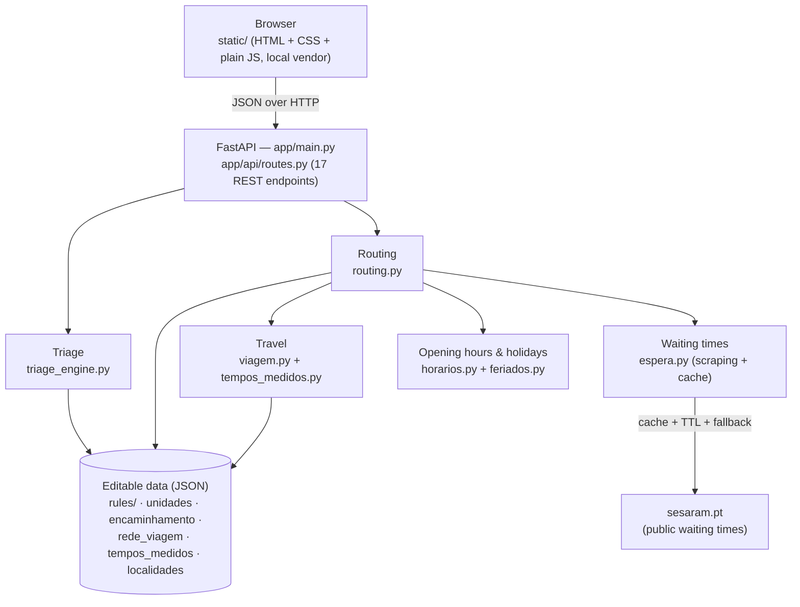

# Architecture of "Onde ir?"

*(v0.13.0 — [versão portuguesa: ARQUITETURA.md](ARQUITETURA.md))*

This document explains **how** the prototype is built and, above all,
**why** — the architectural decisions, what each one buys, and what it
would cost to change it. The README explains how to use the project; this
document explains how to think about it.

## The 30-second overview

A FastAPI application serves, in a single process, a REST API and a static
frontend (HTML + CSS + plain JS, no framework). All logic runs on the
server; the browser only asks questions. There is no database, no sessions
and no accounts: the state of a triage lives in the patient's browser and
is re-sent with every request.



Without Mermaid at hand, the same idea in ASCII:

```
Browser (static/) ──JSON──> FastAPI (routes.py)
                              ├── triage_engine ──> rules/*.json
                              └── routing ─┬─> horarios + feriados
                                           ├─> viagem (network + measured times)
                                           ├─> espera ──cache──> sesaram.pt
                                           └─> unidades.json + encaminhamento.json
```

## The three blocks

The system separates three questions that are tempting to mix:

1. **How urgent is it?** — `triage_engine.py` walks the complaint's
   Manchester discriminators in priority order and returns a colour. A
   *clinical* decision.
2. **Where should the patient go?** — `routing.py` combines the colour
   with the routing policy, opening hours (including holidays), the island
   and waiting times. A *logistical* decision.
3. **How long does it take to get there?** — `viagem.py` estimates the
   driving time. A *geographical* decision.

The separation is deliberate: the clinical team can review block 1 without
knowing anything about roads; whoever calibrates the road network in
block 3 never touches clinical criteria; and the policy in block 2 (which
colours go straight to the hospital) changes in a data file without
rewriting either of the others.

## Module map

| Module (`app/core/`) | Responsibility (one line) |
| --- | --- |
| `triage_engine.py` | Walks the complaint's discriminators by priority and returns the next question or the result; validates every rule at startup. |
| `routing.py` | Colour + location + time → recommended unit, alternatives and explanation; applies the `encaminhamento.json` policy. |
| `espera.py` | Real waiting times (SESARAM), with file cache, short TTL, negative cache and the wait-based swap rule. |
| `viagem.py` | Driving time in three layers (optional OSRM → calibrated network → local model). |
| `tempos_medidos.py` | Editable table of measured road times that corrects local access roads; an avowedly removable module. |
| `horarios.py` | Open/closed at a given moment, with `24h` and `semanal` formats and the `feriado` key. |
| `feriados.py` | National + RAM regional holidays; movable feasts computed with Butcher's algorithm. |
| `localidades.py` | Municipality → parish → locality tree for manual location without GPS. |
| `geo.py` | Haversine distance (and nothing else). |
| `unidades.py` | Health-unit repository. |
| `cores.py` | Manchester colours and associated contacts. |
| `fluxogramas.py` | Generates the Mermaid diagrams from the rules (PT/EN). |
| `sugestoes.py` | Complaint search with synonyms (`sinonimos.json`). |
| `pdf_clinico.py` | One-page PDF with the essentials of the result. |

Each module does one thing; `routing.py` is the largest because it is
where everything meets — if it keeps growing, the plan is to split it into
a `routing/` package (policy, selection, waits, destinations), but that is
not yet justified.

## The decisions, one by one

### 1. Clinical rules are data, not code

Each complaint is a file in `app/data/rules/` (56 Manchester flowcharts
plus the emergency red-flags screen, 1187 discriminators in total). The
engine knows nothing about fever or chest pain; it knows how to walk
discriminator lists by priority.

What this buys: a health professional can review and fix rules without
touching Python; changes show up in a readable diff; the same files
automatically generate the Mermaid flowcharts for visual review
(`/fluxogramas` and `docs/fluxogramas/`); and the rules can be validated
as data — see the next decision.

The same principle repeats for everything that is local knowledge: units
and opening hours (`unidades.json`), the per-colour routing policy
(`encaminhamento.json`), the road network (`rede_viagem.json`), measured
times (`tempos_medidos.json`), localities (`localidades.json`) and
self-care advice (`autocuidado.json`). Two years from now, fixing an
opening hour does not require opening a code editor.

### 2. Validation at startup (fail fast, with a clear message)

Hand-edited data is data that will eventually be wrong. So the server
**refuses to start** if a flowchart has duplicate ids, invalid
priorities or colours, a colour that does not match the priority, or
discriminators out of priority order — and `scripts/validar_dados.py` runs the same
checks (plus units, coordinates and opening hours) without starting the
server, designed for people who edit the JSON and do not program.

The alternative — discovering the error halfway through a real triage —
is not acceptable in a clinical context. Failing at startup turns a data
error into a problem for whoever edited it, at the moment they edited it.

### 3. Stateless and database-free (on purpose)

There are no patient records, sessions or history on the server. The
frontend accumulates the answers and re-sends all of them with each
request; the engine replays the path from scratch (which is cheap: these
are tiny graphs). The only server-side state is a file cache of waiting
times. The patient's triage history stays on their own device
(localStorage).

Why:

- **Privacy by design (GDPR).** The application deals with symptoms —
  sensitive data. The most robust way not to compromise health data is
  not to store it. This is not a limitation: it is a feature, stated in
  the README and in the interface.
- **Operational simplicity.** No migrations, backups or user management;
  deployment is a single process (now, a single container).
- **Testability.** Pure data-in → answer-out functions are easy to test;
  it is one of the reasons the suite has 261 tests.

When would a database become justified? Objective criteria: concurrent
writes (rule editing through an admin interface), volume (hundreds of
units, thousands of localities), relational queries (usage statistics),
or institutional audit requirements. None exists in the prototype. If
they appear, the natural path is PostgreSQL feeding the same modules —
the "data outside the code" boundary is already in the right place for
that migration.

### 4. Why FastAPI

- **Pydantic at the system boundary** (`app/models/schemas.py`): every
  request is validated on entry, with clear errors — important when the
  client is hand-written JS.
- **`/docs` for free**: the interactive OpenAPI documentation doubled as
  a demo tool throughout the internship.
- **Async where it matters**: scraping the waiting times does not block
  the rest of the API.
- **Programmable startup**: the validation from decision 2 runs at import
  time, and the server simply does not come up with invalid data.

Flask would do the same with more glue code; Django would bring an ORM
and an admin that decision 3 deliberately does without.

### 5. Waiting times: scraping with a safety net (provisional)

There is (as yet) no official waiting-times API, so `espera.py` reads the
two public SESARAM pages — the hospital, by clinical area and by the five
Manchester colours, and the health centres with urgent care. Because
scraping is fragile by nature, it is wrapped in layers of protection:

- **File cache with a short TTL** — at most one request per source per
  TTL, with an honest User-Agent; the site is never hammered.
- **Negative cache** — after a failure, it does not retry immediately.
- **Safe fallback** — if the source is unavailable, the application says
  "unavailable" and keeps routing by proximity and opening hours; it
  never invents numbers.
- **Isolation** — only `espera.py` knows the pages' HTML; if the site
  changes, one module changes.

The wait-based swap rule lives in `routing.py`: if the nearest unit has a
wait such that travel + wait at another unit is clearly better, the
recommendation swaps — and **explains why to the patient**, with both
totals. The swap only happens with fresh data; without data, it falls
back silently to proximity.

Stated in the README and here: this is a bridge until an official API
exists. The rest of the system does not know where the numbers come from,
so the replacement is local.

### 6. Driving time in layers (and why not an external service)

In Madeira, straight-line distance lies: Curral das Freiras has Funchal
"right next door" on the map with a mountain ridge in between; the
expressway shortens in time what looks far in kilometres. `viagem.py`
solves this in three layers, from richest to simplest:

1. **Optional OSRM** (`VIAGEM_OSRM_URL`) — a routing server, ideally
   hosted inside the SESARAM network. Off by default: using a public
   server would mean sending patients' coordinates to third parties, a
   decision that belongs to the institution, not to the prototype.
2. **Calibrated network** (the default) — `rede_viagem.json` describes the
   island as ~16 nodes connected by the real road segments (VR1, VE3,
   ER101, …) with typical times and "barriers" that straight-line access
   must not cross; the time between any two points is the shortest path
   in the graph (Dijkstra).
3. **Local model** — for short trips and for connecting origin/destination
   to the network nodes: straight line × detour factor, with speeds by
   distance band. Crude, and avowedly crude: only used where the error is
   bounded.

On top of this, `tempos_medidos.py` applies an editable table with 598
measured origin→destination pairs, which corrects exactly the cases where
the local model inverts neighbours. The code itself describes it as a
removable stopgap: if an internal OSRM appears one day, the module is
removed without touching anything else.

Privacy: in layers 2 and 3, no coordinate ever leaves the server.

### 7. Static frontend, no framework, local vendor

`static/` is HTML + CSS + plain JS. Mermaid, Leaflet and the QR generator
live in `static/vendor/` — no CDN. Consequences: the application opens
without internet (only the map tiles and the live waiting times degrade),
there is no build step and no `node_modules`, and three years from now
the project still starts. For an interface of this size, a framework
would buy little and cost an entire toolchain.

### 8. Bilingual through `_en` variants and an auditor

Everything the backend returns for display — recommendations, notes,
opening hours, weekdays — exists in PT and in an `_en` variant, and the
frontend picks one. The clinical flowcharts carry their translations
inside the JSON files themselves. Since "almost fully translated" is the
natural state of any bilingual project, `scripts/auditar_traducoes.py`
mechanically checks what is missing — the guarantee comes from a tool,
not from memory.

### 9. Tools for the people who edit the data

The `scripts/` folder exists because "editable data" without tools is a
trap: `validar_dados.py` (full check), `auditar_traducoes.py`,
`gerar_validacao_clinica.py` (HTML dossier for clinical review),
`avaliar_viagem.py` and `simular_espera.py` (evaluating the models),
`atualizar_tempos_medidos.py` and friends (maintaining the road-time
table), and `cobertura_testes.py` (v0.13.0: coverage and badge updates).

## The journey of a request

The happy path, end to end:

1. The browser first shows the **emergency red flags**
   (`red_flags.json`); selecting any of them ends in red/112 with no
   further questions.
2. The patient picks the complaint (`GET /api/queixas`, synonym-aware
   search) and answers yes/no questions: on each answer the frontend
   re-sends **all** answers to `POST /api/triagem`, and the engine
   returns either the next question or the result (colour + advice) —
   this is where statelessness shows.
3. With the colour and the location (GPS or municipality → parish →
   locality), the frontend calls `POST /api/encaminhamento`. `routing.py`
   applies the per-colour policy, filters by island, excludes closed
   units (`horarios.py` + `feriados.py`), estimates travel (`viagem.py`),
   checks waits (`espera.py`) and applies the swap rule when justified.
4. The response carries the recommended unit, the explanation (including
   the swap note, if any), alternatives and contacts; the patient can
   export the one-page PDF (`POST /api/exportar_pdf`).

## Degradation modes

Designed to fail in pieces, never all at once:

| Failure | What happens |
| --- | --- |
| No internet on the server | No waiting times (flagged as unavailable); triage and routing by hours/proximity continue. |
| SESARAM page down or changed | Negative cache avoids hammering; "unavailable" fallback; invented numbers are never shown. |
| GPS denied or wrong | Manual mode municipality → parish → locality (`localidades.py`). |
| No internet in the browser | App and flowcharts work (local vendor); only the map tiles fail to load. |
| OSRM configured but down | Short timeout + cooldown; automatic fallback to the calibrated network. |
| JSON edited with an error | The server refuses to start and says exactly what and where (decision 2). |
| Public holiday | `feriados.py` + the `feriado` key in opening hours; without the key, closed is assumed (the safe side of the error). |

## What is left out (on purpose)

No login, JWT, OAuth, profiles, admin panel or database. It is not lack
of time: with decision 3 (store nothing about anyone), there is nothing
to authenticate or administer — adding accounts would create exactly the
personal data the design avoids. If a rule-editing area for the clinical
team ever exists, authentication and change history enter at that moment,
with a clear scope.

## Planned evolution

In likely order, and all local thanks to the boundaries above: an
official waiting-times API replacing the scraping (changes `espera.py`);
an internal SESARAM OSRM (layer 1 is switched on via environment variable
and `tempos_medidos.py` is removed); formal clinical validation of the
flowcharts (changes `rules/`, not the engine); confirmation of the unit
data; PostgreSQL only if the criteria in decision 3 materialise.

---

*New document in v0.13.0. Keeping it short is a goal: if a section grows
too much, it should become its own document in `docs/`.*
