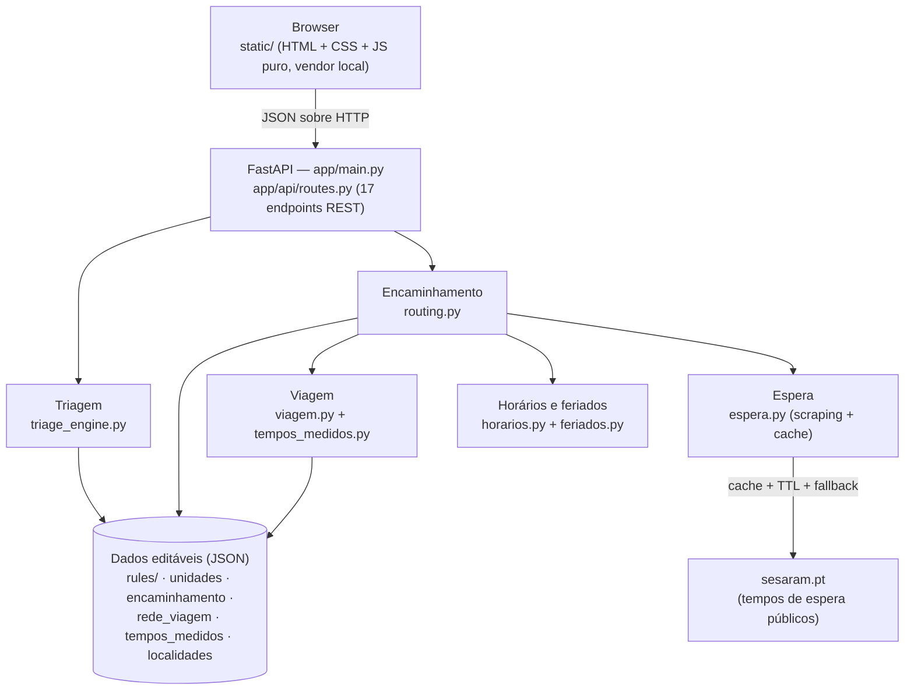

# Arquitetura do "Onde ir?"

*(v0.13.0 — [English version: ARCHITECTURE.md](ARCHITECTURE.md))*

Este documento explica **como** o protótipo está construído e, sobretudo,
**porquê** — as decisões de arquitetura, o que cada uma compra, e o que
custaria mudá-la. O README explica como usar; este documento explica como
pensar sobre o sistema.

## Visão geral em 30 segundos

Uma aplicação FastAPI serve, no mesmo processo, uma API REST e um frontend
estático (HTML + CSS + JS puro, sem framework). Toda a lógica corre no
servidor; o browser só faz perguntas. Não há base de dados, sessões nem
contas: o estado de uma triagem vive no browser do utente e é reenviado a
cada pedido.



Sem Mermaid à mão, a mesma ideia em ASCII:

```
Browser (static/) ──JSON──> FastAPI (routes.py)
                              ├── triage_engine ──> rules/*.json
                              └── routing ─┬─> horarios + feriados
                                           ├─> viagem (rede + tempos medidos)
                                           ├─> espera ──cache──> sesaram.pt
                                           └─> unidades.json + encaminhamento.json
```

## Os três blocos

O sistema separa três perguntas que é tentador misturar:

1. **Quão urgente é?** — `triage_engine.py` percorre os discriminadores
   de Manchester da queixa, por ordem de prioridade, e devolve uma cor.
   Decisão *clínica*.
2. **Para onde deve ir?** — `routing.py` combina a cor com a política de
   encaminhamento, os horários (incluindo feriados), a ilha e os tempos
   de espera. Decisão *logística*.
3. **Quanto demora a chegar?** — `viagem.py` estima o tempo por estrada.
   Decisão *geográfica*.

A separação é deliberada: a equipa clínica pode rever o bloco 1 sem saber
nada de estradas; quem calibra a rede viária no bloco 3 não toca em
critérios clínicos; e a política do bloco 2 (que cores vão diretas ao
hospital) muda num ficheiro de dados sem reescrever nenhum dos outros.

## Mapa dos módulos

| Módulo (`app/core/`) | Responsabilidade (uma linha) |
| --- | --- |
| `triage_engine.py` | Percorre os discriminadores da queixa por prioridade e devolve a próxima pergunta ou o resultado; valida todas as regras no arranque. |
| `routing.py` | Cor + localização + hora → unidade recomendada, alternativas e explicação; aplica a política de `encaminhamento.json`. |
| `espera.py` | Tempos de espera reais (SESARAM), com cache em ficheiro, TTL curto, cache negativa e regra de troca por espera. |
| `viagem.py` | Tempo por estrada em três camadas (OSRM opcional → rede calibrada → modelo local). |
| `tempos_medidos.py` | Tabela editável de tempos medidos que corrige os acessos locais; módulo assumidamente amovível. |
| `horarios.py` | Aberto/fechado a uma dada hora, com formatos `24h` e `semanal` e a chave `feriado`. |
| `feriados.py` | Feriados nacionais + regionais da RAM; móveis calculados pelo algoritmo de Butcher. |
| `localidades.py` | Árvore concelho → freguesia → sítio para localização manual sem GPS. |
| `geo.py` | Distância de Haversine (e nada mais). |
| `unidades.py` | Repositório das unidades de saúde. |
| `cores.py` | Cores de Manchester e contactos associados. |
| `fluxogramas.py` | Gera os diagramas Mermaid a partir das regras (PT/EN). |
| `sugestoes.py` | Pesquisa de queixas com sinónimos (`sinonimos.json`). |
| `pdf_clinico.py` | PDF de uma página com o essencial do resultado. |

Cada módulo faz uma coisa; `routing.py` é o maior porque é o ponto onde
tudo se junta — se continuar a crescer, o plano é parti-lo num pacote
`routing/` (política, seleção, espera, destinos), mas ainda não se
justifica.

## As decisões, uma a uma

### 1. As regras clínicas são dados, não código

Cada queixa é um ficheiro em `app/data/rules/` (56 fluxogramas de
Manchester + sinais de emergência, 1187 discriminadores no total). O motor
não sabe nada de febre ou dor torácica; sabe percorrer listas de
discriminadores por prioridade.

O que isto compra: um profissional de saúde revê e corrige regras sem
tocar em Python; as alterações ficam visíveis num diff legível; os mesmos
ficheiros geram automaticamente os fluxogramas Mermaid para revisão visual
(`/fluxogramas` e `docs/fluxogramas/`); e as regras podem ser validadas
como dados — ver a decisão seguinte.

O mesmo princípio repete-se em tudo o que é conhecimento do terreno:
unidades e horários (`unidades.json`), política de encaminhamento por cor
(`encaminhamento.json`), rede viária (`rede_viagem.json`), tempos medidos
(`tempos_medidos.json`), localidades (`localidades.json`) e autocuidado
(`autocuidado.json`). Daqui a dois anos, corrigir um horário não exige
abrir um editor de código.

### 2. Validação no arranque (falhar cedo e com mensagem clara)

Dados editáveis à mão são dados que um dia vêm errados. Por isso o
servidor **recusa arrancar** se um fluxograma tiver ids repetidos,
prioridades ou cores inválidas, uma cor que não corresponde à prioridade,
ou discriminadores fora da ordem de prioridade — e `scripts/validar_dados.py` faz a mesma
verificação (mais unidades, coordenadas e horários) sem arrancar o
servidor, pensado para quem edita os JSON e não programa.

A alternativa — descobrir o erro a meio de uma triagem real — não é
aceitável num contexto clínico. Falhar no arranque transforma um erro de
dados num problema de quem editou, no momento em que editou.

### 3. Stateless e sem base de dados (de propósito)

Não há registos de utentes, sessões nem histórico no servidor. O frontend
acumula as respostas e reenvia-as todas a cada pedido; o motor reproduz o
percurso do zero (é barato: são grafos minúsculos). O único estado no
servidor é um cache de tempos de espera em ficheiro. O histórico de
triagens do utente fica no próprio dispositivo (localStorage).

Porquê:

- **Privacidade por desenho (RGPD).** A aplicação lida com sintomas — dado
  sensível. A forma mais robusta de não comprometer dados de saúde é não
  os guardar. Não é uma limitação: é uma característica, afirmada no
  README e na interface.
- **Simplicidade operacional.** Sem migrações, backups nem gestão de
  utilizadores; o deploy é um processo único (agora, um contentor único).
- **Testabilidade.** Funções puras de dados → resposta são fáceis de
  testar; é uma das razões de a suite ter 261 testes.

Quando é que uma base de dados passaria a justificar-se? Critérios
objetivos: escrita concorrente (edição de regras via interface de
administração), volume (centenas de unidades, milhares de localidades),
consultas relacionais (estatísticas de utilização), ou requisitos de
auditoria institucional. Nenhum existe no protótipo. Se surgirem, o
caminho natural é PostgreSQL a alimentar os mesmos módulos — a fronteira
"dados fora do código" já está no sítio certo para essa migração.

### 4. Porquê FastAPI

- **Pydantic nos limites do sistema** (`app/models/schemas.py`): cada
  pedido é validado à entrada, com erros claros — importante quando o
  cliente é JS escrito à mão.
- **`/docs` de graça**: a documentação interativa OpenAPI serviu de
  ferramenta de demonstração ao longo do estágio.
- **Async onde interessa**: o scraping dos tempos de espera não bloqueia o
  resto da API.
- **Arranque programável**: a validação da decisão 2 corre no import, e o
  servidor simplesmente não sobe com dados inválidos.

Flask faria o mesmo com mais código de cola; Django traria ORM e admin
que a decisão 3 dispensa de propósito.

### 5. Tempos de espera: scraping com rede de segurança (provisório)

Não existe (ainda) uma API oficial de tempos de espera, por isso
`espera.py` lê as duas páginas públicas do SESARAM — hospital, por área
clínica e pelas cinco cores de Manchester, e centros de saúde com
atendimento urgente. Como scraping é frágil por natureza, está embrulhado
em camadas de proteção:

- **Cache em ficheiro com TTL curto** — no máximo um pedido por fonte por
  TTL, com User-Agent honesto; nunca se martela o site.
- **Cache negativa** — depois de uma falha, não se insiste de imediato.
- **Fallback seguro** — se a fonte estiver indisponível, a aplicação
  diz "indisponível" e continua a encaminhar por proximidade e horários;
  nunca inventa números.
- **Isolamento** — só `espera.py` conhece o HTML das páginas; se o site
  mudar, muda-se um módulo.

A regra de troca por espera vive em `routing.py`: se a unidade mais
próxima tiver uma espera tal que viagem + espera noutra unidade fique
claramente melhor, a recomendação troca — e **explica ao utente porquê**,
com os dois totais. A troca só acontece com dados frescos; sem dados,
recua-se em silêncio para a proximidade.

Assumido no README e aqui: isto é uma ponte até existir uma API oficial.
O resto do sistema não sabe de onde vêm os números, portanto a
substituição é local.

### 6. Viagem por estrada em camadas (e porquê não um serviço externo)

Na Madeira, distância em linha reta engana: o Curral das Freiras tem o
Funchal "encostado" no mapa e uma serra pelo meio; a via rápida encurta em
tempo o que parece longe em quilómetros. `viagem.py` resolve isto em três
camadas, da mais rica para a mais simples:

1. **OSRM opcional** (`VIAGEM_OSRM_URL`) — um servidor de rotas, idealmente
   alojado na rede do SESARAM. Desligado por omissão: usar um servidor
   público implicaria enviar coordenadas de utentes a terceiros, decisão
   que pertence à instituição, não ao protótipo.
2. **Rede calibrada** (por omissão) — `rede_viagem.json` descreve a ilha
   como ~16 nós ligados pelos troços reais (VR1, VE3, ER101, …) com tempos
   típicos e "barreiras" que a linha reta não pode atravessar; o tempo
   entre dois pontos é o caminho mais curto no grafo (Dijkstra).
3. **Modelo local** — para trajetos curtos e para ligar origem/destino aos
   nós: linha reta × fator de desvio, com velocidades por escalão.
   Grosseiro, e assumidamente grosseiro: só se usa onde o erro é limitado.

Por cima disto, `tempos_medidos.py` aplica uma tabela editável com 598
pares origem→destino medidos, que corrige exatamente os casos onde o
modelo local inverte vizinhos. É descrito no próprio código como
paliativo amovível: se um dia houver OSRM interno, remove-se o módulo sem
tocar no resto.

Privacidade: nas camadas 2 e 3, nenhuma coordenada sai do servidor.

### 7. Frontend estático, sem framework, com vendor local

`static/` é HTML + CSS + JS puro. Mermaid, Leaflet e o gerador de QR
vivem em `static/vendor/` — sem CDN. Consequências: a aplicação abre sem
internet (só os azulejos do mapa e os tempos de espera degradam), não há
build step nem `node_modules`, e daqui a três anos o projeto arranca na
mesma. Para a dimensão desta interface, um framework compraria pouco e
custaria uma toolchain inteira.

### 8. Bilingue com variantes `_en` e um auditor

Tudo o que o backend devolve para mostrar ao utente — recomendações,
notas, horários, dias da semana — existe em PT e em variante `_en`, e o
frontend escolhe. Os fluxogramas clínicos incluem as traduções nos
próprios JSON. Como "quase tudo traduzido" é o estado natural de qualquer
projeto bilingue, `scripts/auditar_traducoes.py` verifica mecanicamente o
que falta — a garantia é de ferramenta, não de memória.

### 9. Ferramentas para quem edita dados

A pasta `scripts/` existe porque "dados editáveis" sem ferramentas é uma
armadilha: `validar_dados.py` (verificação completa), `auditar_traducoes.py`,
`gerar_validacao_clinica.py` (dossier HTML para revisão clínica),
`avaliar_viagem.py` e `simular_espera.py` (avaliar os modelos),
`atualizar_tempos_medidos.py` e afins (manter a tabela de tempos), e
`cobertura_testes.py` (v0.13.0: cobertura e atualização dos badges).

## O percurso de um pedido

O caminho feliz, de ponta a ponta:

1. O browser mostra primeiro os **sinais de emergência** (`red_flags.json`);
   qualquer um selecionado termina em vermelho/112 sem mais perguntas.
2. O utente escolhe a queixa (`GET /api/queixas`, pesquisa com sinónimos)
   e responde a perguntas sim/não (uma por discriminador): a cada resposta, o frontend reenvia
   **todas** as respostas para `POST /api/triagem`, e o motor devolve a
   próxima pergunta ou o resultado (cor + conselho) — é aqui que o
   stateless se vê.
3. Com a cor e a localização (GPS ou concelho → freguesia → sítio), o
   frontend chama `POST /api/encaminhamento`. `routing.py` aplica a
   política por cor, filtra por ilha, exclui unidades fechadas
   (`horarios.py` + `feriados.py`), estima viagens (`viagem.py`), consulta
   esperas (`espera.py`) e aplica a regra de troca se justificada.
4. A resposta traz a unidade recomendada, a explicação (incluindo a nota
   de troca, se houver), alternativas e contactos; o utente pode exportar
   o PDF de uma página (`POST /api/exportar_pdf`).

## Modos de degradação

Projetado para falhar aos bocados, nunca de uma vez:

| Falha | O que acontece |
| --- | --- |
| Sem internet no servidor | Sem tempos de espera (assinalado como indisponível); triagem e encaminhamento por horários/proximidade continuam. |
| Página do SESARAM em baixo ou alterada | Cache negativa evita insistir; fallback "indisponível"; nunca se mostram números inventados. |
| GPS negado ou errado | Modo manual concelho → freguesia → sítio (`localidades.py`). |
| Sem internet no browser | App e fluxogramas funcionam (vendor local); só os azulejos do mapa não carregam. |
| OSRM configurado mas em baixo | Tempo limite curto + arrefecimento; recuo automático para a rede calibrada. |
| JSON editado com erro | O servidor não arranca e diz exatamente o quê e onde (decisão 2). |
| Feriado | `feriados.py` + chave `feriado` dos horários; sem a chave, assume-se fechado (o lado seguro do erro). |

## O que fica de fora (de propósito)

Sem login, JWT, OAuth, perfis, painel de administração ou base de dados.
Não é falta de tempo: com a decisão 3 (não guardar nada de ninguém), não
há nada para autenticar nem administrar — acrescentar contas criaria
exatamente os dados pessoais que o desenho evita. Se um dia existir uma
área de edição de regras para a equipa clínica, autenticação e histórico
de alterações entram nesse momento, com âmbito claro.

## Evolução prevista

Por ordem provável, e todas locais graças às fronteiras acima: API oficial
de tempos de espera a substituir o scraping (muda `espera.py`); OSRM
interno do SESARAM (liga-se a camada 1 por variável de ambiente e
remove-se `tempos_medidos.py`); validação clínica formal dos fluxogramas
(muda `rules/`, não o motor); confirmação dos dados das unidades;
PostgreSQL apenas se os critérios da decisão 3 se materializarem.

---

*Documento novo na v0.13.0. Mantê-lo curto é objetivo: se uma secção
crescer demasiado, deve tornar-se um documento próprio em `docs/`.*
